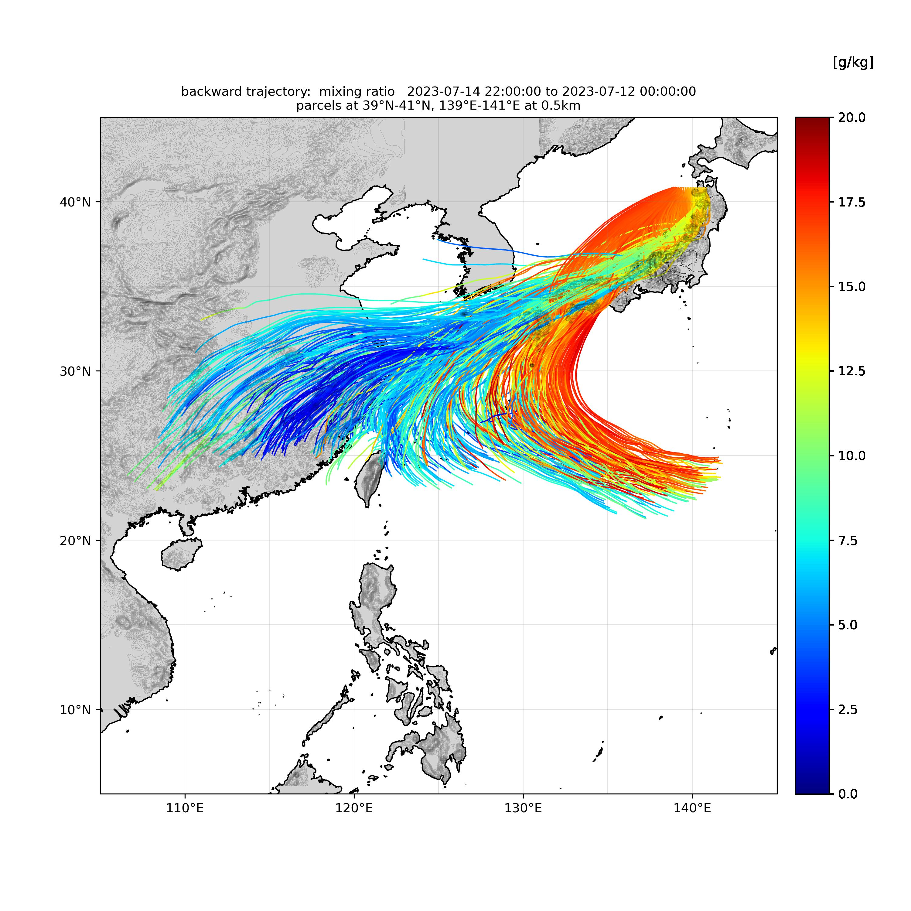
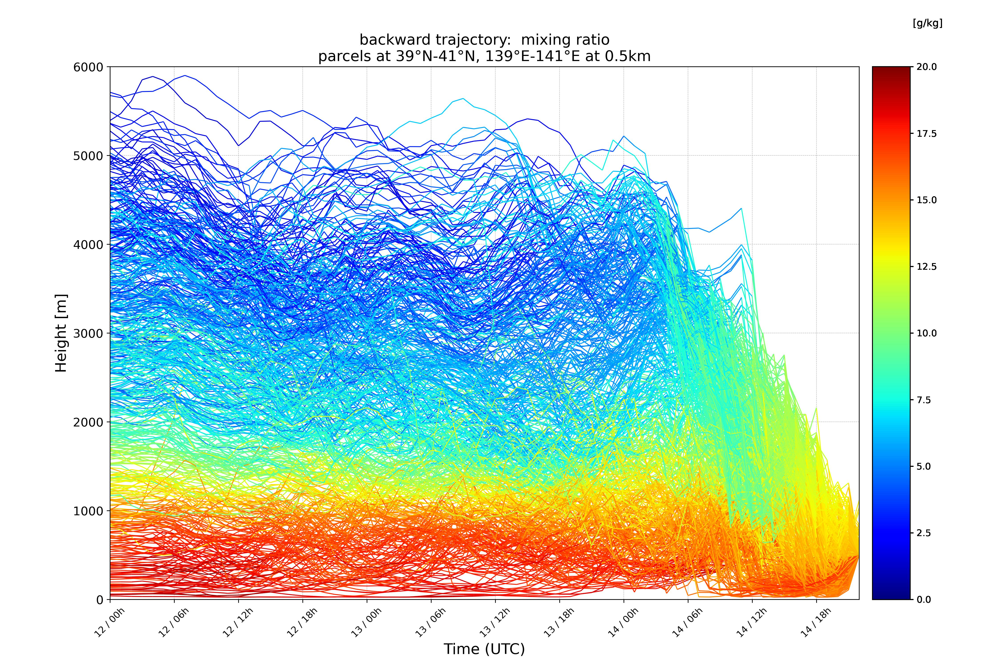

# RIP4 Trajectory Visualization

RIP4 による流跡線解析の結果を可視化します。



## Feature

- RIP4 の backward/forward trajectory の流跡線を地図上に可視化します。
- 時間-高度図を作成して、流跡線の物理量の時間変化を可視化します。
- パーセルの物理量変化をカラーによって表現します。

## 仮想環境

conda

```bash
conda env create -f env.yml
conda activate rip4
```

## Usage

1. `src/config/configuration.py`で描画する変数や範囲等を設定

2. `src/main.py`を実行して、画像を作成

   ```bash
   python src/main.py
   ```

作成された画像は `img`下に出力されます。

## Note

変数名は、`src/constant/variables.py`を参照してください。<br>
パーセルを配置した矩形領域は正しく設定してください。図のタイトルおよびファイル名に反映されます。<br>
